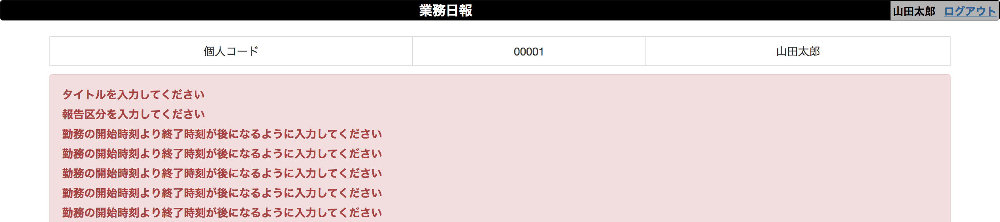
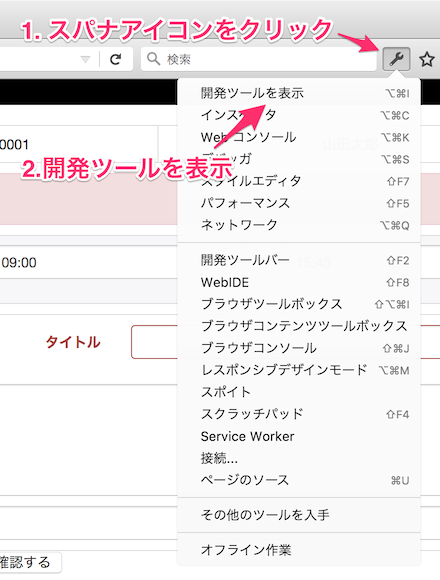
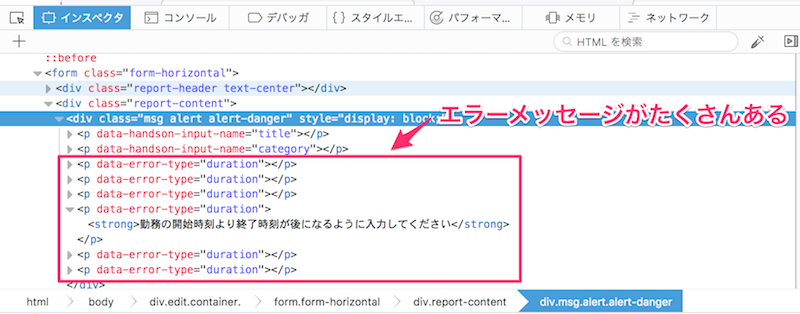
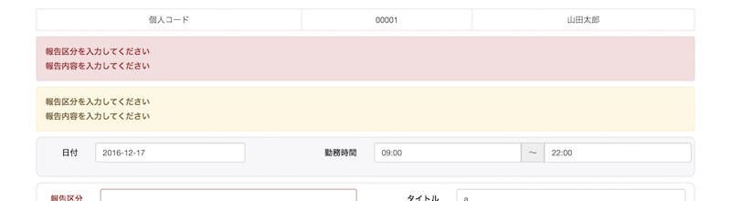
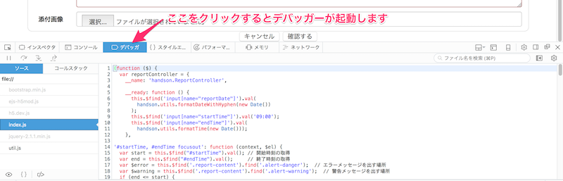
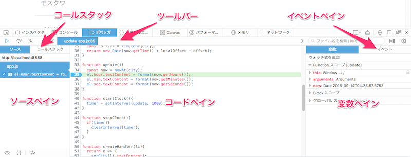
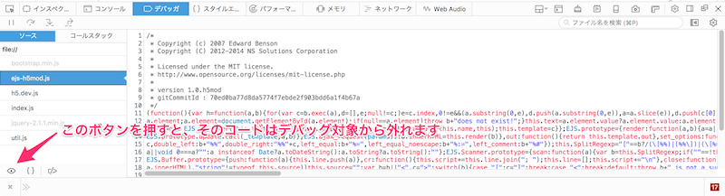
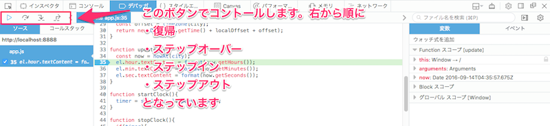
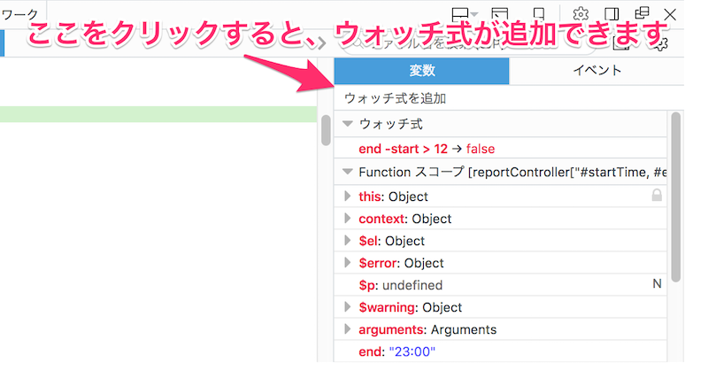
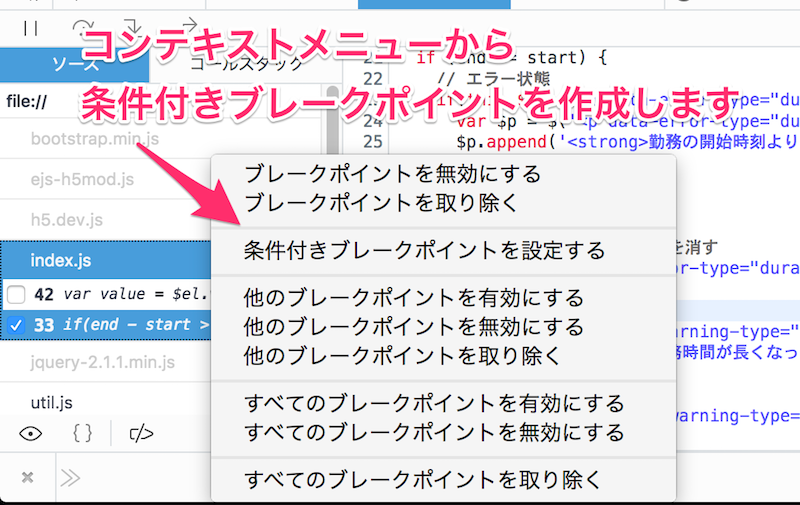

# 日報アプリを作る（その6）「デバッガーを使おう」

前回まで日報アプリの機能が概ねできました。
今回はこのアプリに勤務時間の検証機能を追加しましょう。
追加する過程で発生する不具合をデバッガーを使って解消してゆきます。

サンプルコードは 07 フォルダ内のものを利用します。
このフォルダーは、[こちらからもダウンロード](7.zip)できます。

## コードを追加する場所

js/index.js に次のメソッドが追加されています。
ここに勤務時間の検証機能を追加してゆきます。

~~~javascript
'#startTime, #endTime focusout': function(context, $el){
},
~~~

[ステップ 5](5.md) で入力内容の検証機能を実装しました。
今回の内容も入力内容の検証にあたるため、そのメソッド内に実装するほうが望ましいと考えられるかもしれません。
ただ今回の目的はあくまでデバッガーの使い方を理解することです。
それを踏まえるとデバッグコードが短いほうが、効率が良いため、メソッドをわけ、実装を行います。

## 開始時間と終了時間の取得

入力された開始時間と終了時間を取得します。
開始時間の入力欄には `startTime`、終了時間の入力欄には `endTime` という ID が振られています。
それを利用して、要素を検索し、その値を取得します。

**変更前**

~~~javascript
'#startTime, #endTime focusout': function(context, $el){
},
~~~

**変更後**

~~~javascript
'#startTime, #endTime focusout': function(context, $el){
  var start = this.$find("#startTime").val();
  var end = this.$find("#endTime").val();
},
~~~

## インスペクターを使った問題の調査

現在の実装では、勤務の開始時刻が終了時刻より後でも動作してしまいます。
そのような場合はエラーメッセージを表示する、という機能を追加します。

**変更前**

~~~javascript
'#startTime, #endTime focusout': function(context, $el){
  var start = this.$find("#startTime").val(); // 開始時刻の取得
  var end = this.$find("#endTime").val();     // 終了時刻の取得
},
~~~

**変更後**

~~~javascript
'#startTime, #endTime focusout': function(context, $el){
  var start = this.$find("#startTime").val();
  var end = this.$find("#endTime").val();
  if(end <= start){
// エラー状態
  }else{
// 正常状態
  }
},
~~~

次はエラーメッセージの表示を行います。
[ステップ 5](5.md) の内容をコピー & ペーストして、次のように実装します。

**変更後**

~~~javascript
'#startTime, #endTime focusout': function(context, $el){
  var start = this.$find("#startTime").val(); // 開始時刻の取得
  var end = this.$find("#endTime").val();     // 終了時刻の取得
  var $msg = this.$find('.report-content').find('.msg');  // メッセージを出す場所
  if(end <= start){
// エラー状態
    var $p = $('
');
    $p.append('<strong>勤務の開始時刻より終了時刻が後になるように入力してください</strong>');
    $msg.append($p);
  }else{
// 正常状態
    // 入力した項目のメッセージを消す
    $msg.find('p[data-error-type="duration"]').remove();
  }
},
~~~

ここまで入力したら、正しく動作するかどうかを確認します。
上記のコードだと、次のように複数のエラーメッセージが表示されてしまいます。

次の手順で再現できるかと思います：

1. 開始時刻に終了時刻より後の時刻を入力する
2. 終了時刻の入力欄にフォーカスを移す
3. 開始時刻の入力欄にフォーカスを移す

このエラーを修正しましょう。そのために利用するのが開発ツールです (c.f. [MDN の開発ツールの解説ページ](https://developer.mozilla.org/ja/docs/Tools))。

下図のように、スパナアイコンをクリックして表示されるメニューの「開発ツールを表示」をクリックすることで、開発ツールを起動できます。

インスペクターでエラーメッセージが表示されている部分を確認すると、次のようになっています。

該当するエラーメッセージが表示済みかどうかは、1 つ以上 `p[data-error-type="duration"]` に該当する要素があるかどうかで判断できそうです。
その仮説に基づいて、コードを修正します。

**変更前**

~~~javascript
'#startTime, #endTime focusout': function(context, $el){
  var start = this.$find("#startTime").val(); // 開始時刻の取得
  var end = this.$find("#endTime").val();     // 終了時刻の取得
  var $msg = this.$find('.report-content').find('.msg');  // メッセージを出す場所
  if(end <= start){
// エラー状態
    var $p = $('
');
    $p.append('<strong>勤務の開始時刻より終了時刻が後になるように入力してください</strong>');
    $msg.append($p);
  }else{
// 正常状態
    // 入力した項目のメッセージを消す
    $msg.find('p[data-error-type="duration"]').remove();
  }
},
~~~

**変更後**

~~~javascript
'#startTime, #endTime focusout': function (context, $el) {
  var start = this.$find("#startTime").val(); // 開始時刻の取得
  var end = this.$find("#endTime").val();     // 終了時刻の取得
  var $msg = this.$find('.report-content').find('.msg');  // メッセージを出す場所
  if (end <= start) {
    // エラー状態
    if(this.$find('p[data-error-type="duration"]').length == 0){
      var $p = $('
');
      $p.append('<strong>勤務の開始時刻より終了時刻が後になるように入力してください</strong>');
      $msg.append($p);
    }
  } else {
    // 正常状態
    // 入力した項目のメッセージを消す
    $msg.find('p[data-error-type="duration"]').remove();
  }
},
~~~

修正できているかどうかを、確認します。

## デバッガーを利用した、不具合原因の探求

入力された勤務時間が長時間の場合、警告を発する機能を追加します。
表示するのあくまで警告で、日報の登録それ自身には影響がないものとします。
また長時間労働の定義には議論があるそうですが、ここでは 12 時間を超えるものを長時間と定義します。

まずは HTML に、警告用を表示するための要素を追加します。
これは現在の HTML にはエラーを表示するための要素はあっても、警告用のものがないためです。
index.html の 47 行目付近を以下のように変更します。
｀alert-warning` というクラスの div 要素を追加しています。

**変更前**

~~~html

  

    

~~~

**変更後**

~~~html

  

  

  
    

~~~

これに合わせて、JavaScript を次のように変更します。
変更するのは次の 2 点です

* これまで `$msg` という名前にしていた変数を `$error` に変更
* 警告を表示するための場所を参照するための変数 `$warning` を追加

**変更前**

~~~javascript
'#startTime, #endTime focusout': function (context, $el) {
  var start = this.$find("#startTime").val(); // 開始時刻の取得
  var end = this.$find("#endTime").val();     // 終了時刻の取得
  var $msg = this.$find('.report-content').find('.msg');  // メッセージを出す場所
  if (end <= start) {
    // エラー状態
    if(this.$find('p[data-error-type="duration"]').length == 0){
      var $p = $('
');
      $p.append('<strong>勤務の開始時刻より終了時刻が後になるように入力してください</strong>');
      $msg.append($p);
    }
  } else {
    // 正常状態
    // 入力した項目のメッセージを消す
    $msg.find('p[data-error-type="duration"]').remove();
  }
},
~~~

**変更後**

~~~javascript
'#startTime, #endTime focusout': function (context, $el) {
  var start = this.$find("#startTime").val(); // 開始時刻の取得
  var end = this.$find("#endTime").val();     // 終了時刻の取得
  var $error = this.$find('.report-content').find('.alert-danger');  // エラーメッセージを出す場所
  var $warning = this.$find('.report-content').find('.alert-warning');  // 警告メッセージを出す場所  
  if (end <= start) {
    // エラー状態
    if(this.$find('p[data-error-type="duration"]').length == 0){
      var $p = $('
');
      $p.append('<strong>勤務の開始時刻より終了時刻が後になるように入力してください</strong>');
      $error.append($p);
    }
  } else {
    // 正常状態
    // 入力した項目のメッセージを消す
    $error.find('p[data-error-type="duration"]').remove();
  }
},
~~~

これで警告メッセージを出す準備はできました。次は長時間労働の判定を行います。
上記のコードを次のように修正します。

~~~javascript
'#startTime, #endTime focusout': function (context, $el) {
  var start = this.$find("#startTime").val(); // 開始時刻の取得
  var end = this.$find("#endTime").val();     // 終了時刻の取得
  var $error = this.$find('.report-content').find('.alert-danger');  // エラーメッセージを出す場所
  var $warning = this.$find('.report-content').find('.alert-warning');  // 警告メッセージを出す場所  
  if (end <= start) {
    // エラー状態
    if(this.$find('p[data-error-type="duration"]').length == 0){
      var $p = $('
');
      $p.append('<strong>勤務の開始時刻より終了時刻が後になるように入力してください</strong>');
      $error.append($p);
    }
  } else {
    // 正常状態
    // 入力した項目のメッセージを消す
    $error.find('p[data-error-type="duration"]').remove();

    if(end - start > 12){
      var $p = $('
');
      $p.append('<strong>勤務時間が長くなっています</strong>');
      $warning.append($p);
    }else{
      $warning.find('[data-warning-type="too-long-work"]').remove();
    }
  }
},
~~~

では 12 時間以上の勤務となるように勤務時間を入力し、正しく動作するかどうかを確認します。
そうすると、2 つ問題があることがわかります。1 つめは次のようにエラーと警告に同じメッセージが重複して表示されることです。
2 つめは実装した機能が動作していないことです。この 2 つを修正します。

まずはエラーと警告に同じメッセージが重複して出力される不具合を修正します。
フォームをいろいろ操作して現象を観察すると、
報告区分、タイトル、報告内容などが入力されていないことを通知するエラーが重複して出力されることがわかります。
では原因となっているコードを突き止める作業に入ります。ここで利用するツールがデバッガーです。

### デバッガーとは

デバッグ作業を支援するプログラムのことをデバッガーと呼びます。
Firefox の開発ツールには、JavaScript のデバッグを支援するデバッガーが含まれており、
次の機能を持っています。

* 指定した位置でプログラムの実行を一旦停止する機能
* プロググラムを 1 行ずつ実行する機能
* 変数に代入されている値の確認と変更
* 値や条件の監視

これらの機能については使いながら解説してゆきます。まずはデバッガーを起動しましょう。
開発ツールに「デバッガ」というタブがあります。それをクリックするとデバッガーが起動します。

デバッガーはいくつかのパーツから構成されています。それぞれのパーツは次のように呼びます。
ソースペインにあるファイルをクリックすると、その内容がコードペインに表示されます。

### デバッグ対象ファイルの絞り込み

起動したら、まずデバッグ対象のファイルを絞ります。や hifive そのものをデバッグするなら不要です。
しかし今回は index.js と util.js のみに絞ってデバッグを行うため、これらをデバッグ対象から外します。

ソースペインに表示されているファイルの中から、ejs-h5mod.js を探し、クリックします。
ソースコードが表示された、下図にあるボタンをクリックし、そのファイルを「ブラックボックス化」します。
ブラックボックス化されたコードはデバッグ対象から外れます。
同様に h5.dev.js もブラックボックス化しておきましょう。

### ブレークポイントの設置とステップ実行

では、エラーと警告が重複して表示される問題の原因を探ります。
先ほどの観察から、報告区分、タイトル、報告内容などが入力されていないことを通知するエラーが重複して出力されることがわかっています。
この処理を行っているのは、[ステップ 5](5.md) で実装したメソッドです。
このメソッドの振る舞いを観察することで、原因を探します。

コードペインに index.js を表示したら、42 行目をクリックします。
次のように行番号の上にマークが表示されます。
このマークのことを「ブレークポイント」と呼びます。
処理がブレークポイントの設定されている行に達すると、ブラウザーは実行を一時停止し、
私たちの操作を待ちます。

ここでできる操作は復帰、ステップオーバー、ステップイン、ステップアウトの 4 つです。
それぞれの操作を行うためのボタンは、下図を参照してください。

ではブラウザーを操作して、報告区分にあるフォーカスを他へ移します。
そうすると、先ほどブレークポイントを設定した行に色がつき、そこで処理が一時停止します。

ステップオーバーを行うと、処理が 1 行ずつ進んでゆきます。
しばらくすると、エラーと警告が重複して表示されます。
直接の原因は、その直前に実行した行にあります。その行は `$msg` に対して処理を行ってます。

では、`$msg` に代入されている値を確認します。
この時、役立つのが変数ペインです。これはソースペインの右に表示されています。
変数ペインを見ると、 `$msg` には `Object` が代入されていることがわかります。
ドリルダウンすると、エラーメッセージを出力する div 要素以外に、警告を出力する div 要素も
このオブジェクトは参照していることがわかります。
このことから `$msg` に代入を行なっているところが原因であることがわかります。
その行を次のように修正します。

**修正前**

~~~javascript
var $msg = this.$find('.report-content').find('.msg');
~~~

**修正後**

~~~javascript
var $msg = this.$find('.report-content').find('.alert-danger');
~~~

修正後、正しく動作するかを確認します。

### ブレークポイントの削除

設定されているブレークポイントを削除は、次のいずれかで行えます。

* コードペインで、ブレークポイントをクリックする
* ソースペインにリストアップされているブレークポイントの上で、コンテキストメニューを表示し、そこから削除を選ぶ

### ウォッチ式：式によるプログラムの状態確認

次に実装した機能が動作していない問題を解決します。
実装した行にブレークポイントを設置して動きを見てゆきます。
そうすると、警告を出力するパスが実行されていないことがわかります。
これは条件分岐の条件式が `false` と評価されているからかもしれません。
これを確認するために、ウォッチ式を利用します。

変数ペインにある「ウォッチ式を追加」と書かれた部分をクリックします。
そこに次の式を入力してください。

~~~javascript
end - start > 12
~~~

入力すると、変数ペインにウォッチ式が追加されます。
この式はステップ実行時に都度評価され、その評価値が変数ペインに表示されます。
これを使うと、変数の値として観測できない状態を観測できるようになります。

また `end - start` もウォッチ式に追加します。そうすると、勤務時間の計算が正しく行えていないことがわかります。
これは、`end` と `start` に代入されている値が、文字列であることに起因しています。
これを修正するために次の関数を util.js へ追加します。

**変更前**

~~~javascript
escapeHTML: function(html) {
  return $('
').text(html).html();
}
~~~

**変更後**

~~~javascript
escapeHTML: function(html) {
  return $('
').text(html).html();
}, // カンマを忘れないようにしてください
createDateFromTimeString(timeString){
  var now = new Date();
  var time = timeString.split(":");
  now.setHours(time[0]);
  now.setMinutes(time[1]);
  return now;
}
~~~

これを利用すると、`09:00`のような時刻表記から、`Date` オブジェクト(c.f [Date - MDN](https://developer.mozilla.org/ja/docs/Web/JavaScript/Reference/Global_Objects/Date)) を取得できます。
実際には index.js を次のように変更します。

**変更前**

~~~javascript
'#startTime, #endTime focusout': function (context, $el) {
  var start = this.$find("#startTime").val(); // 開始時刻の取得
  var end = this.$find("#endTime").val();     // 終了時刻の取得
  var $error = this.$find('.report-content').find('.alert-danger');  // エラーメッセージを出す場所 
~~~

**変更後**

~~~javascript
'#startTime, #endTime focusout': function (context, $el) {
  var start = this.$find("#startTime").val(); // 開始時刻の取得
  var end = this.$find("#endTime").val();     // 終了時刻の取得  
	start = handson.utils.createDateFromTimeString(start);
	end = handson.utils.createDateFromTimeString(end);
  var $error = this.$find('.report-content').find('.alert-danger');  // エラーメッセージを出す場所   
~~~

これで正しく動作するかどうかを確認します。

### 条件付きブレークポイント

ブレークポイントを削除したくはないが、常にブレークされては困る場合がでてきます。
そういう場合に便利な機能が「条件付きブレークポイント」です。
これを利用すると、特定の条件が成立した時のみ処理を一時停止するブレークポイントが作成できます。

ソースペインにリストされているブレークポイントのうち、条件付きにしたいものの上でコンテキストメニューを表示します。
「条件付きブレークポイントを設定する」を選ぶと、式を記入できるようになります。
ここに条件式を記入することで、条件付きブレークポイントを設定できます。

例えば `Number.isNaN(end - start)` と記入すると、
`end - start` の評価値が `NaN` の時のみ、処理をブレークするようになります。

## まとめ

今回は機能の追加を行う過程で生じた問題の原因を、開発ツールを利用して探りました。
利用したツールは次の二つです：

* インスペクター
* デバッガー

DOM ツリーの様子を様子を確認するなら前者を、
JavaScript の振る舞いやプログラムの状態を確認するには後者を利用します。

これら以外にも様々な機能が開発ツールには付属しています。
詳しくは [MDN の開発ツール](https://developer.mozilla.org/ja/docs/Tools) をご覧ください。